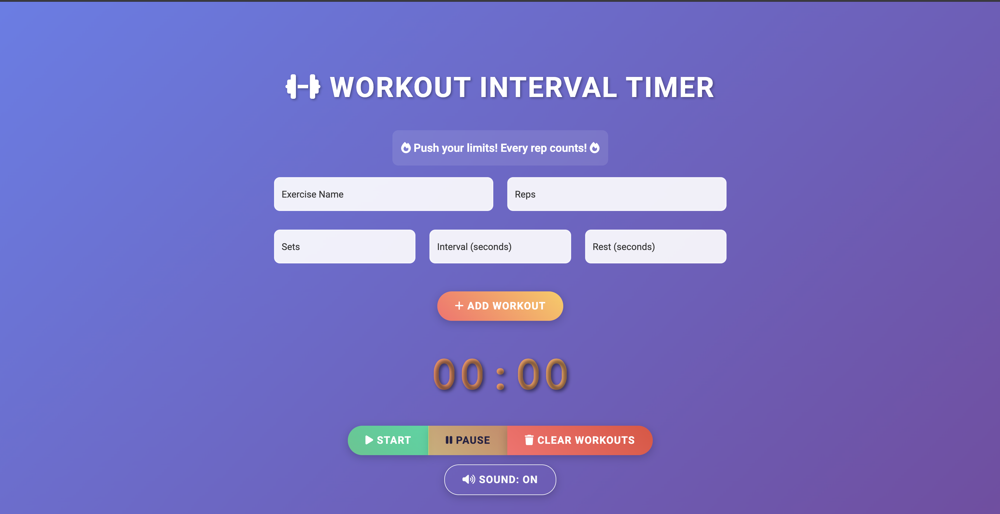

# 🏋️ Workout Interval Timer

A modern, feature-rich web-based interval timer designed specifically for fitness enthusiasts! This application helps you manage your workout routines with style, motivation, and precision.

## ✨ Features

### 🎨 **Modern UI/UX**
- **Full-screen responsive design** that utilizes the entire display
- **Stunning gradient backgrounds** with glassmorphism effects
- **Smooth animations** and visual feedback throughout the app
- **Modern typography** with Google Fonts (Roboto)
- **Icon-rich interface** using Font Awesome icons

### 💪 **Workout Management**
- **Custom workout creation** with exercise name, reps, sets, intervals, and rest periods
- **Visual workout list** with easy-to-read formatting and completion status
- **Individual workout removal** with delete buttons
- **Real-time progress tracking** with visual indicators
- **Workout statistics** showing completed vs total workouts

### ⏱️ **Advanced Timer Features**
- **Large, animated timer display** with state-based visual feedback
- **Automatic workout/rest period transitions** with distinct visual cues
- **Set progress indicators** with animated progress bars
- **Last 10-second countdown warnings** with pulsing animations
- **Total workout time tracking** displayed upon completion

### 🎵 **Audio & Motivation**
- **Text-to-speech announcements** for workout states and transitions
- **Sound effects** using Web Audio API
- **Sound toggle control** for user preference
- **Dynamic motivational messages** that change during workout/rest periods
- **Celebration effects** with confetti animation upon completion

### 📱 **Accessibility & Mobile**
- **Fully responsive design** optimized for all screen sizes
- **Touch-friendly buttons** with proper sizing for mobile devices
- **High contrast mode support** for accessibility
- **Reduced motion preferences** respected for users with vestibular disorders
- **Screen reader friendly** with proper ARIA labels

## 🎯 **Enhanced User Experience**
- **Form validation** with success/error feedback
- **Confirmation dialogs** for destructive actions
- **Motivational messaging system** with 8+ unique workout messages and 6+ rest messages
- **Visual state indicators** (workout vs rest) with color-coded animations
- **Keyboard navigation support** for accessibility

## 🚀 Getting Started

### Installation
1. Download or clone this repository
2. Ensure all files (`workout_timer.html`, `workout_timer.css`, `workout_timer.js`, and image files) are in the same folder
3. Open `workout_timer.html` in your preferred web browser
4. Start creating your custom workouts!

### Quick Start Guide
1. **Add a workout**: Fill in the exercise name, reps, sets, interval time, and rest time
2. **Build your routine**: Add multiple exercises to create a complete workout
3. **Start training**: Click the "Start" button to begin your workout
4. **Follow the prompts**: The app will guide you through each exercise with visual and audio cues
5. **Stay motivated**: Enjoy the motivational messages and celebrate your completion!

## 🎮 How to Use

### Creating Workouts
- **Exercise Name**: Enter the name of your exercise (e.g., "Push-ups", "Squats")
- **Reps**: Number of repetitions per set
- **Sets**: Total number of sets for this exercise
- **Interval**: Time in seconds for each working period
- **Rest**: Time in seconds between sets

### Timer Controls
- **▶️ Start**: Begin your workout routine
- **⏸️ Pause**: Pause the timer (can be resumed)
- **🗑️ Clear**: Remove all workouts from your list
- **🔊 Sound Toggle**: Turn audio announcements on/off

### Visual Indicators
- **Green glow**: Rest period
- **Red glow**: Workout period  
- **Progress bars**: Show set completion
- **Pulsing timer**: Last 10 seconds warning

## 🛠️ Technical Details

### Built With
- **HTML5** - Structure and semantics
- **CSS3** - Modern styling with gradients, animations, and glassmorphism
- **Vanilla JavaScript** - Core functionality and timer logic
- **Bootstrap 5** - Responsive grid and utilities
- **Font Awesome** - Icon library
- **Google Fonts** - Typography (Roboto)
- **Web Audio API** - Sound effects
- **Speech Synthesis API** - Text-to-speech announcements

### Browser Compatibility
- ✅ Chrome (recommended)
- ✅ Firefox
- ✅ Safari
- ✅ Edge
- ✅ Mobile browsers (iOS Safari, Chrome Mobile)

## 📋 Features Breakdown

| Feature | Description |
|---------|-------------|
| 🎨 **Modern UI** | Gradient backgrounds, glassmorphism, smooth animations |
| 📱 **Responsive** | Works perfectly on desktop, tablet, and mobile |
| 🔊 **Audio Cues** | Text-to-speech and sound effects (toggleable) |
| 💪 **Motivation** | Dynamic motivational messages and celebration effects |
| ⏱️ **Smart Timer** | Visual countdown with state-based animations |
| 📊 **Progress** | Real-time tracking of sets, reps, and completion |
| ♿ **Accessible** | Screen reader friendly, keyboard navigation, high contrast |
| 🎯 **User-Friendly** | Intuitive interface with helpful feedback |

## 🎉 What's New in This Version

- ✨ **Complete UI overhaul** with modern gradient design
- 🖥️ **Full-screen layout** for better user interaction
- 🎵 **Enhanced audio system** with motivational announcements
- 📱 **Improved mobile experience** with touch-friendly controls
- 🎊 **Celebration animations** when workouts are completed
- 📈 **Progress visualization** with animated progress bars
- 🔧 **Better state management** and workout statistics
- ♿ **Accessibility improvements** for all users

## 🤝 Contributing

Feel free to fork this project and submit pull requests for any improvements!

## 📝 License

This project is open source and available under the MIT License.

## 🔗 Links

- **GitHub Repository**: [codecaine-zz/workout_interval_timer](https://github.com/codecaine-zz/workout_interval_timer)
- **Live Demo**: [https://codefreelance.net/apps/interval_timer/](https://codefreelance.net/apps/interval_timer/)

---

**Happy exercising! 💪🔥**

*Built with ❤️ for the fitness community*
